# Inteligência Competitiva de Preços

Uma startup de e-commerce focada em acessórios para smartphones precisa desenvolver inteligência competitiva para apoiar suas estratégias de precificação. Para isso, o time de dados deve responder a dez perguntas de negócio relacionadas ao mercado de smartphones no Brasil, abordando temas como distribuição de preços, comportamento do frete grátis, ranking de marcas, correlação entre descontos e volume de vendas, além da evolução dos preços ao longo do tempo.

## Nota Sobre Uso De IA No Desenvolvimento

O arquivo [PROMPT.md](PROMPT.md) registra o prompt inicial usado para orientar o desenvolvimento assistido por IA deste case. Nele, os passos de execução foram definidos previamente e as ferramentas de IA deveriam seguir essas instruções, validando com a autora antes de alterar decisões de escopo ou arquitetura. Durante o desenvolvimento, foram usadas as ferramentas Codex e Cursor como apoio para implementação, documentação, revisão e ajustes, mantendo o controle decisório com a autora do projeto.

## Fonte De Dados Escolhida

A fonte oficial escolhida foi o Magazine Luiza, usando páginas públicas de busca como:

```text
https://www.magazineluiza.com.br/busca/smartphone/
https://www.magazineluiza.com.br/busca/iphone/
https://www.magazineluiza.com.br/busca/samsung%20galaxy/
```

A escolha do Magalu foi feita porque ele é um varejista brasileiro relevante, tem alta cobertura de smartphones, mostra preço, seller, marca, avaliações e desconto nos cards de busca, e permite uma coleta simples sem depender de banco servidor, API privada ou plataforma externa.

Limitações importantes da fonte:

- `sold_quantity` não é exposto de forma confiável na busca pública.
- `review_count` é usado como proxy de volume quando `sold_quantity` está ausente.
- `free_shipping` só é preenchido quando o card expõe texto explícito de frete grátis.
- Frete pode depender de CEP, seller, campanha, login e carrinho.

## Visão Macro Da Arquitetura

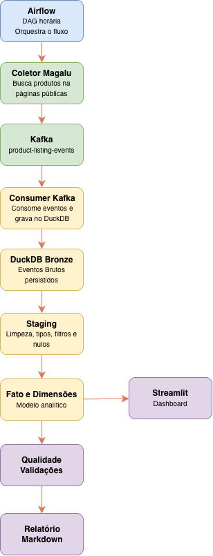

## Fluxo De Extração Do Coletor

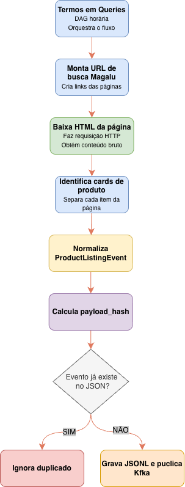

Cada produto válido vira um `ProductListingEvent`. O `payload_hash` é a chave de idempotência usada no JSONL, no Kafka e na Bronze do DuckDB.

## Como Rodar Do Zero

Pré-requisitos:

- Docker
- Docker Compose

Passos:

```bash
docker compose up --build
```

Serviços disponíveis:

- Airflow: `http://localhost:8081`
- Streamlit: `http://localhost:8501`
- Kafka externo para debug local: `localhost:9094`

Credenciais do Airflow:

```text
usuário: admin
senha: admin
```

Depois que o Compose subir, a DAG `price_monitoring_smartphones` fica responsável por rodar a coleta e as transformações a cada hora.

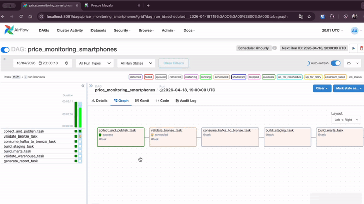

Para subir somente o dashboard:

```bash
docker compose up -d --build streamlit
```

Para parar tudo:

```bash
docker compose down
```

Para pausar somente novas coletas, pause a DAG no Airflow ou rode:

```bash
docker compose exec airflow airflow dags pause price_monitoring_smartphones
```

## Execução Local Para Desenvolvimento

```bash
python -m venv .venv
source .venv/bin/activate
pip install -r requirements.txt
python -m src.orchestration.cli --stream-backend local-jsonl
```

Testes e validações:

```bash
./.venv/bin/python -m pytest
docker compose config
```

## Variáveis De Ambiente

As variáveis ficam no arquivo `.env` na raiz do projeto. Ele já concentra os defaults não sensíveis usados pelo Docker Compose, pelo Airflow, pela coleta, pelo DuckDB e pelo dashboard.

| Variável | Uso |
|---|---|
| `QUERIES` | Termos buscados no Magalu, separados por vírgula. |
| `PAGES` | Quantidade de páginas coletadas por termo. |
| `LIMIT` | Limite de cards processados por página. |
| `MIN_ROWS` | Volume mínimo esperado na validação Bronze. |
| `REQUEST_TIMEOUT` | Timeout HTTP do coletor. |
| `LOG_LEVEL` | Nível de log da coleta. |
| `BRONZE_PATH` | Caminho do JSONL auditável da coleta. |
| `QUEUE_PATH` | Fila local JSONL usada no fallback sem Kafka. |
| `DB_PATH` | Caminho do arquivo DuckDB persistido. |
| `AUDIT_PATH` | Auditoria JSONL das execuções. |
| `REPORT_PATH` | Relatório Markdown gerado ao final da DAG. |
| `STREAM_BACKEND` | Backend de stream: `kafka` no Docker ou `local-jsonl` local. |
| `KAFKA_BOOTSTRAP_SERVERS` | Endereço do Kafka. No Docker, use `kafka:9092`. |
| `KAFKA_TOPIC` | Tópico Kafka dos eventos de produto. |
| `KAFKA_CONSUMER_GROUP` | Grupo do consumidor que carrega a Bronze. |
| `KAFKA_IDLE_TIMEOUT_SECONDS` | Tempo ocioso para encerrar o consumo batch. |

## Decisões Arquiteturais

- **Magalu como fonte**: fonte brasileira, pública e aderente ao domínio de smartphones.
- **Kafka como contrato de evento**: cada produto coletado vira um evento publicado em `product-listing-events`.
- **DuckDB como arquivo**: o warehouse fica em `data/warehouse/gocase.duckdb`, sem serviço de banco separado.
- **JSONL auditável**: além do DuckDB, a coleta é registrada em arquivo para inspeção e reprocessamento.
- **Airflow real via Docker Compose**: a DAG separa coleta, validação, consumo, staging, marts, qualidade e relatório.
- **Streamlit separado do Airflow**: o dashboard roda em container próprio e lê o DuckDB em modo somente leitura.
- **Idempotência por `payload_hash`**: evita duplicar eventos repetidos entre coletas.
- **Volume de vendas como proxy**: `sales_volume_proxy = coalesce(sold_quantity, review_count)`.
- **Frete conservador**: ausência de texto de frete no card vira `unknown`, não `false`.
- **Sem stack pesada**: dbt, Spark e banco servidor ficaram fora para manter a solução simples e reproduzível.

## Modelo Analítico

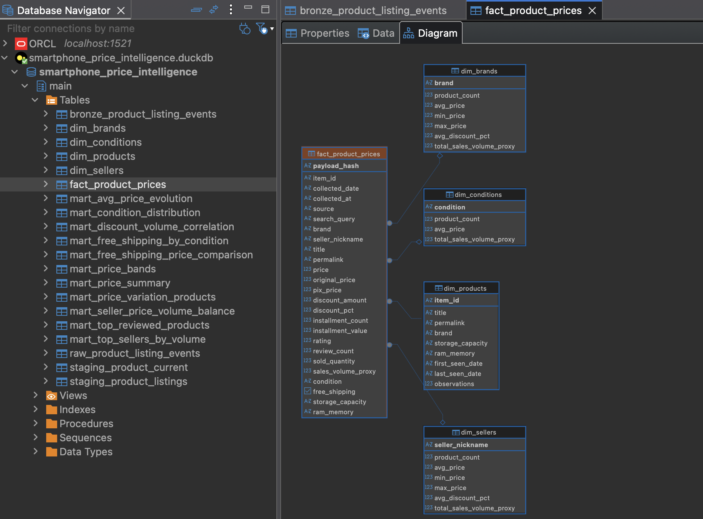

Grãos principais:

- `bronze_product_listing_events`: um evento bruto por `payload_hash`.
- `staging_product_listings`: uma observação limpa de produto por coleta.
- `staging_product_current`: última observação conhecida por `item_id`.
- `fact_product_prices`: histórico de observações de preço.

Dimensões:

- `dim_products`
- `dim_brands`
- `dim_sellers`
- `dim_conditions`

Marts:

- `mart_price_summary`: preço médio, mínimo e máximo por data.
- `mart_free_shipping_by_condition`: frete grátis, frete pago e desconhecido por condição.
- `mart_top_sellers_by_volume`: ranking de vendedores por volume proxy.
- `mart_discount_volume_correlation`: correlação entre desconto e volume proxy.
- `mart_avg_price_evolution`: evolução diária do preço médio.
- `mart_condition_distribution`: distribuição por condição e ticket médio.
- `mart_price_variation_products`: variação entre primeiro e último preço coletado.
- `mart_free_shipping_price_comparison`: preço médio por status de frete.
- `mart_price_bands`: histograma em faixas de R$ 500.
- `mart_seller_price_volume_balance`: equilíbrio entre preço competitivo e volume proxy.

## Qualidade E Idempotência

Validações Bronze:

- volume mínimo;
- origem Magalu;
- campos obrigatórios preenchidos;
- ausência de `payload_hash` duplicado;
- cobertura mínima de marca e `review_count`.

Validações Warehouse:

- tabelas obrigatórias existem;
- Bronze, Staging, fato e marts têm linhas;
- campos obrigatórios do fato não são nulos;
- `payload_hash` não duplica no fato;
- preço e desconto estão em faixas válidas;
- fato possui correspondência em `dim_products`.

A idempotência acontece em três pontos:

- JSONL da coleta;
- chave da mensagem Kafka;
- chave primária da Bronze no DuckDB.

## Dashboard Streamlit

O dashboard em `src/dashboard/app.py` responde às 10 perguntas de negócio usando os marts materializados pela DAG. Ele não cria tabelas nem escreve no DuckDB. Cada consulta abre uma conexão `read_only=True` e fecha em seguida.

A sidebar mostra:

- caminho do banco;
- última coleta em horário local;
- contagem de eventos Bronze;
- botão para atualizar dados.

O cache do dashboard usa TTL curto de 60 segundos. Isso reduz leituras repetidas no DuckDB e permite refletir novas execuções do Airflow sem recriar containers.

## Insights Das 10 Perguntas

Os números abaixo refletem o snapshot atual do arquivo `data/warehouse/gocase.duckdb`. Como a DAG roda de hora em hora, os valores podem mudar após novas coletas.

1. **Qual é o preço médio, mínimo e máximo de smartphones na plataforma?**

   A amostra atual tem 661 produtos. O preço médio é R$ 2.958,38, com mínimo de R$ 98,64 e máximo de R$ 20.718,76. A amplitude é alta porque a busca retorna desde itens muito baratos e acessórios residuais até smartphones premium.

   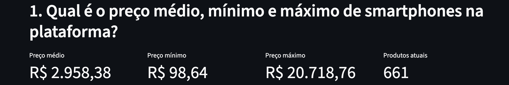

2. **Qual proporção dos produtos oferece frete grátis? Isso varia entre produtos novos e usados?**

   A informação de frete ficou `unknown` para 661 de 661 produtos. Isso não significa que não há frete grátis; significa que a busca pública do Magalu não expôs esse dado nos cards coletados. Portanto, não é possível comparar frete grátis entre novos e usados com segurança.

   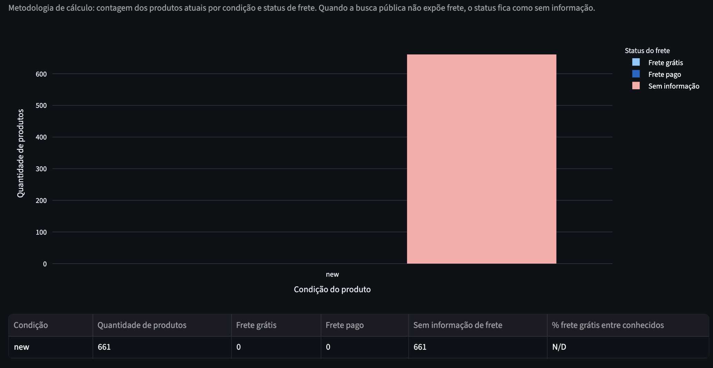

3. **Quais são os 10 vendedores com maior volume total de produtos vendidos?**

   O ranking por volume proxy é liderado por `magazineluiza`, com 224 produtos e volume proxy de 223.850. Em seguida aparecem `lojaiplace` com 48.559, `shopnext` com 22.944 e `oficialamericanas` com 19.356. Esse volume usa `sales_volume_proxy = coalesce(sold_quantity, review_count)`.

   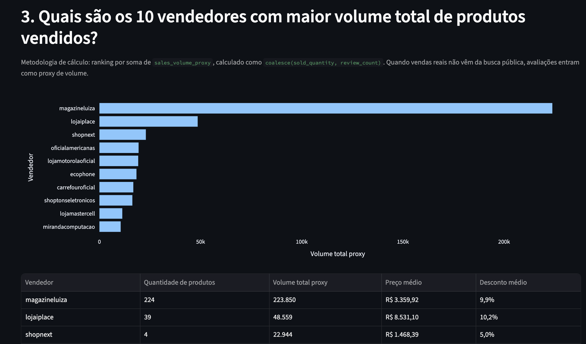

4. **Existe correlação entre o percentual de desconto oferecido e a quantidade vendida?**

   A correlação entre desconto e volume proxy é -0,068. Esse valor está muito próximo de zero, indicando ausência de relação linear relevante. A leitura correta é que, nesta amostra, descontos maiores não aparecem associados a maior volume proxy.

   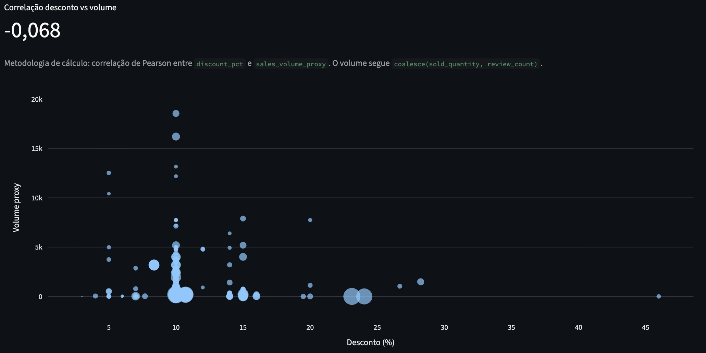

5. **Como o preço médio da categoria evoluiu ao longo dos dias coletados?**

   O preço médio foi R$ 3.280,02 em 16/04/2026, caiu para R$ 2.991,94 em 17/04/2026 e subiu para R$ 3.075,40 em 18/04/2026. A variação parece refletir mais a mudança do mix de produtos coletados, especialmente participação de Apple e aparelhos premium, do que uma mudança uniforme de preços.

   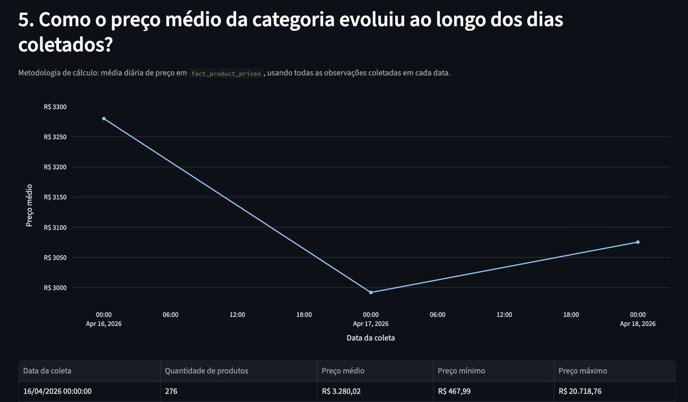

6. **Qual a distribuição dos produtos por condição e qual grupo tem ticket médio mais alto?**

   Todos os 661 produtos atuais foram classificados como `new`. Não há grupo `used` suficiente para comparação. O ticket médio disponível, portanto, representa apenas produtos novos: R$ 2.958,38.

   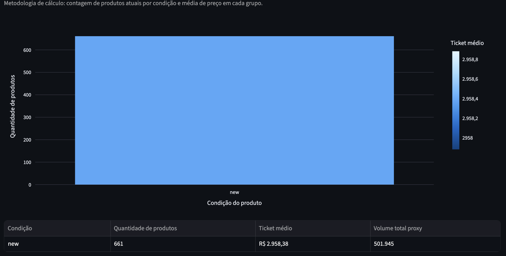

7. **Quais produtos tiveram a maior variação de preço entre o primeiro e o último registro coletado?**

   A maior variação absoluta foi do iPhone Air Apple 256GB, com alta de R$ 5.149,08 entre o primeiro e o último registro. O ranking também mostra quedas relevantes em modelos Apple e Samsung, como iPhone 17 Pro 1TB e Galaxy A36/A56.

   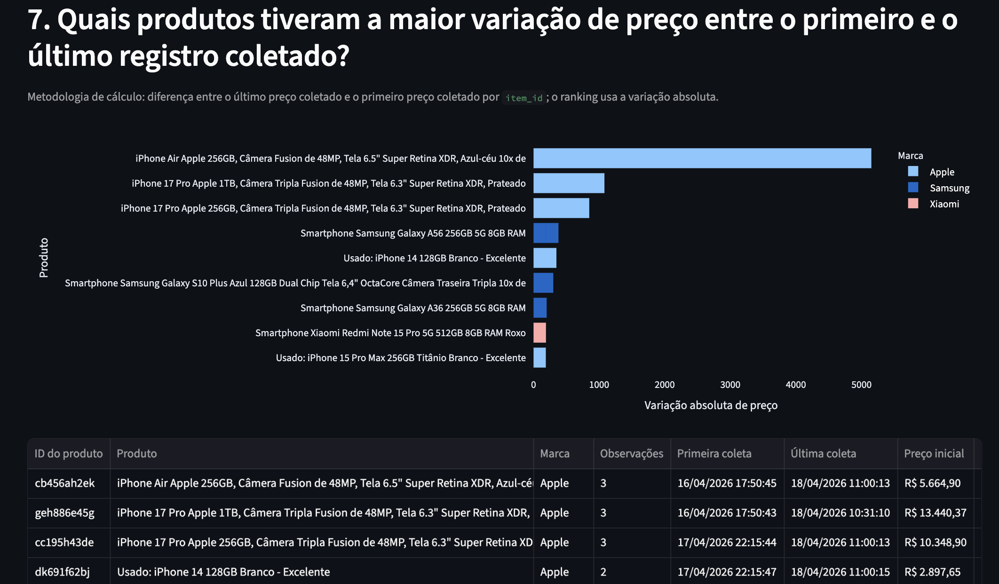

8. **Os produtos com frete grátis têm preço médio maior ou menor do que os sem frete grátis?**

   Não foi possível comparar. Todos os 661 produtos atuais estão como `unknown` para frete, com preço médio de R$ 2.958,38. A fonte pública não expôs frete grátis ou frete pago de forma confiável.

   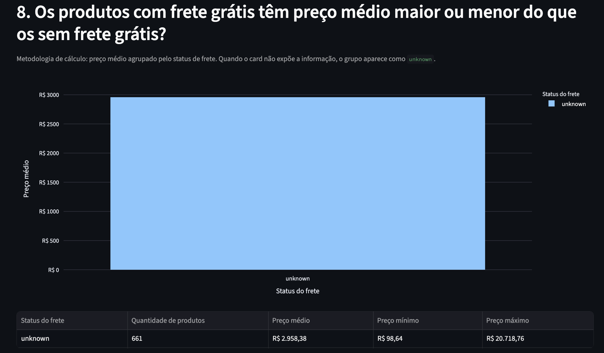

9. **Qual a faixa de preço com maior concentração de produtos?**

   A faixa com maior concentração é R$ 1.000 a R$ 1.499, com 153 produtos. Em seguida aparecem R$ 1.500 a R$ 1.999, com 100 produtos, e R$ 500 a R$ 999, com 93 produtos. A distribuição mostra forte concentração em aparelhos de entrada e intermediários.

   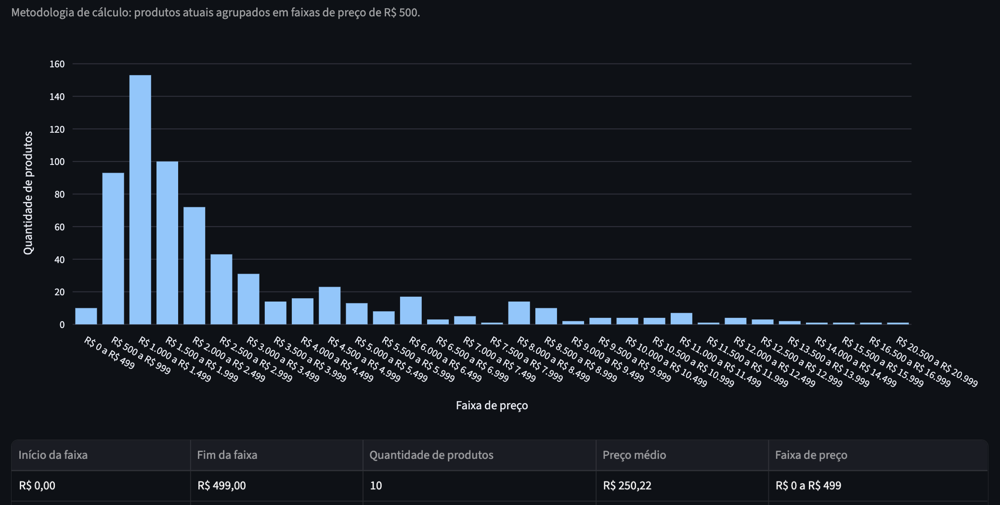

10. **Quais vendedores têm o melhor equilíbrio entre preço competitivo e volume de vendas?**

    Pelo score `sum(sales_volume_proxy) / avg(price)`, `magazineluiza` lidera com 66,62. Depois aparecem `shopnext` com 15,63, `carrefouroficial` com 12,92 e `oficialamericanas` com 11,29. O score favorece vendedores com alto volume proxy e preço médio mais baixo.

    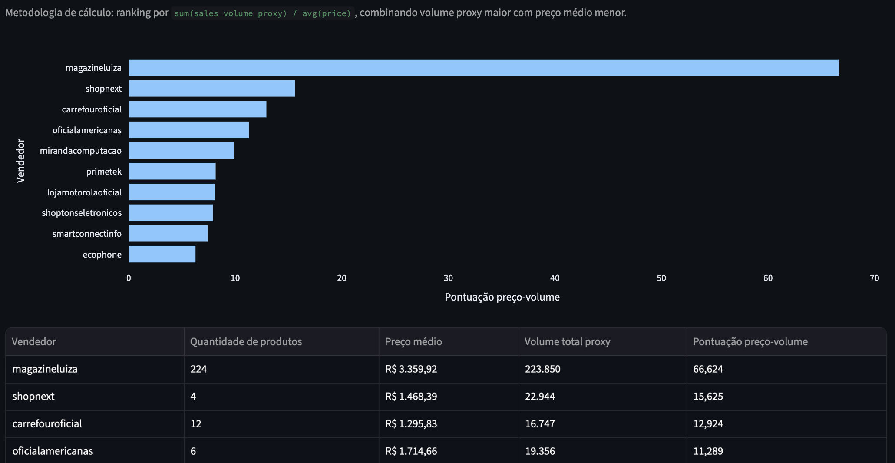
